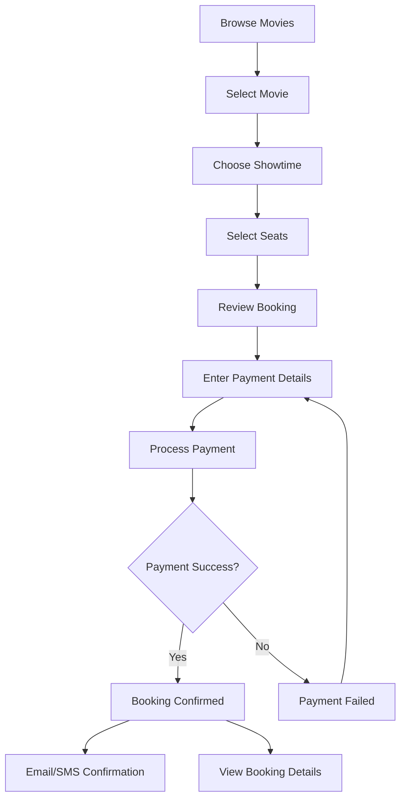
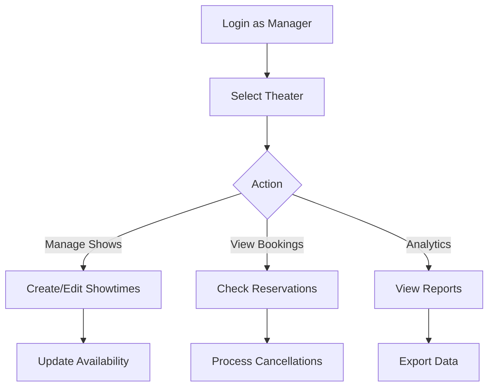

# 🎬 CineGo - Movie Ticket Booking Platform

<div align="center">


**A full-stack movie ticket booking platform with real-time seat selection, payment processing, and multi-role management**
</br>
**click on Render logo for Live application**

[](https://cinego-app.onrender.com)
[](https://cinego-3q2f.onrender.com)

[Features](#-features) • [Architecture](#-architecture) • [Tech Stack](#-tech-stack) • [User Roles](#-user-roles) • [Getting Started](#-getting-started)

</div>

---

## 🌟 Features

### For End Users
- 🎥 **Browse Movies** - Explore now showing and upcoming movies with detailed information
- 🎫 **Book Tickets** - Select showtimes, choose seats with real-time availability
- 💳 **Secure Payments** - Integrated Stripe payment gateway for safe transactions
- 📧 **Notifications** - Email and SMS confirmations for bookings
- 👤 **Profile Management** - View booking history and manage account details
- ❌ **Cancellations** - Cancel bookings with automatic refund processing

### For Theater Managers
- 🏢 **Theater Management** - Manage theater details, screens, and seat layouts
- 🎬 **Show Management** - Create and manage movie showtimes
- 📊 **Booking Analytics** - View bookings and revenue for managed theaters
- 🎟️ **Seat Availability** - Real-time seat locking and availability tracking

### For Administrators
- 🎭 **Movie Management** - Add, edit, and manage movie catalog
- 🏛️ **Theater Administration** - Oversee all theaters and screens
- 👥 **User Management** - Manage users and assign theater managers
- 📈 **Dashboard Analytics** - Comprehensive insights on bookings and revenue
- 🔔 **System Monitoring** - Track notifications and system health

---

## 🏗️ Architecture

```
┌─────────────────────────────────────────────────────────────────┐
│                         CLIENT LAYER                             │
│  ┌──────────────────────────────────────────────────────────┐  │
│  │  React + Vite + TailwindCSS + Redux Toolkit              │  │
│  │  • Responsive UI • Real-time Updates • State Management  │  │
│  └──────────────────────────────────────────────────────────┘  │
└─────────────────────────────────────────────────────────────────┘
                              ↕ HTTPS/REST API
┌─────────────────────────────────────────────────────────────────┐
│                       APPLICATION LAYER                          │
│  ┌──────────────────────────────────────────────────────────┐  │
│  │  Node.js + Express.js                                     │  │
│  │  • RESTful API • JWT Authentication • Role-based Access  │  │
│  └──────────────────────────────────────────────────────────┘  │
└─────────────────────────────────────────────────────────────────┘
                              ↕
┌─────────────────────────────────────────────────────────────────┐
│                        SERVICE LAYER                             │
│  ┌──────────────┐  ┌──────────────┐  ┌──────────────────────┐ │
│  │   Payment    │  │ Notification │  │   File Storage       │ │
│  │   (Stripe)   │  │ (Email/SMS)  │  │   (Cloudinary)       │ │
│  └──────────────┘  └──────────────┘  └──────────────────────┘ │
└─────────────────────────────────────────────────────────────────┘
                              ↕
┌─────────────────────────────────────────────────────────────────┐
│                         DATA LAYER                               │
│  ┌──────────────┐  ┌──────────────┐  ┌──────────────────────┐ │
│  │   MongoDB    │  │    Redis     │  │     RabbitMQ         │ │
│  │  (Database)  │  │   (Cache)    │  │  (Message Queue)     │ │
│  └──────────────┘  └──────────────┘  └──────────────────────┘ │
└─────────────────────────────────────────────────────────────────┘
```

---

## 🛠️ Tech Stack

### Frontend
- **Framework:** React 18 with Vite
- **Styling:** TailwindCSS
- **State Management:** Redux Toolkit
- **Routing:** React Router v6
- **HTTP Client:** Axios
- **Payment UI:** Stripe Elements
- **Notifications:** Custom Toast System

### Backend
- **Runtime:** Node.js
- **Framework:** Express.js
- **Database:** MongoDB with Mongoose ODM
- **Caching:** Redis
- **Message Queue:** RabbitMQ
- **Authentication:** JWT (JSON Web Tokens)
- **File Upload:** Multer + Cloudinary
- **Email:** Nodemailer
- **SMS:** Twilio
- **Payment:** Stripe

### DevOps & Deployment
- **Hosting:** Render (Frontend & Backend)
- **Database:** MongoDB Atlas
- **Cache:** Redis Cloud
- **CDN:** Cloudinary
- **Version Control:** Git & GitHub

---

## 👥 User Roles

### 1. End User (Customer)
**Capabilities:**
- Browse and search movies
- View movie details and showtimes
- Select seats and book tickets
- Make secure payments
- View booking history
- Cancel bookings
- Manage profile

### 2. Theater Manager
**Capabilities:**
- All End User capabilities
- Manage assigned theaters
- Create and manage screens
- Schedule movie showtimes
- View theater-specific bookings
- Access theater analytics

### 3. Administrator
**Capabilities:**
- All Theater Manager capabilities
- Manage all movies in the system
- Manage all theaters and screens
- Assign theater managers
- View system-wide analytics
- Manage all users
- Access admin dashboard

---

## 🔄 User Flow

### Booking Flow (End User)



### Theater Management Flow



---

## 📊 Process Flow

### Seat Booking Process

```
1. User selects seats
   ↓
2. Seats locked in Redis (10 min TTL)
   ↓
3. User proceeds to payment
   ↓
4. Payment processed via Stripe
   ↓
5. Booking created in MongoDB
   ↓
6. Seat availability updated
   ↓
7. Redis locks released
   ↓
8. Notifications sent (Email + SMS)
   ↓
9. WebSocket broadcast to update UI
```

### Cancellation Process

```
1. User requests cancellation
   ↓
2. Validate cancellation policy (2 hours before show)
   ↓
3. Update booking status
   ↓
4. Release seats in database
   ↓
5. Process refund (if applicable)
   ↓
6. Send cancellation notification
   ↓
7. Update analytics
```

---

## 🚀 Getting Started

### Prerequisites
- Node.js (v16 or higher)
- MongoDB
- Redis
- RabbitMQ (optional for notifications)
- Stripe Account
- Cloudinary Account

### Installation

1. **Clone the repository**
```bash
git clone https://github.com/abhilash-dev-glitch/CineGo.git
cd CineGo
```

2. **Install Backend Dependencies**
```bash
cd backend
npm install
```

3. **Install Frontend Dependencies**
```bash
cd ../frontend
npm install
```

4. **Configure Environment Variables**

Create `.env` file in backend directory:
```env
# Server
PORT=3000
NODE_ENV=development

# Database
MONGODB_URI=your_mongodb_connection_string

# JWT
JWT_SECRET=your_jwt_secret
JWT_EXPIRE=30d
JWT_COOKIE_EXPIRE=30

# Redis
REDIS_URL=your_redis_connection_string

# RabbitMQ
RABBITMQ_URL=your_rabbitmq_connection_string

# Cloudinary
CLOUDINARY_CLOUD_NAME=your_cloud_name
CLOUDINARY_API_KEY=your_api_key
CLOUDINARY_API_SECRET=your_api_secret

# Stripe
STRIPE_SECRET_KEY=your_stripe_secret_key
STRIPE_WEBHOOK_SECRET=your_webhook_secret

# Email (Gmail)
EMAIL_HOST=smtp.gmail.com
EMAIL_PORT=587
EMAIL_USER=your_email@gmail.com
EMAIL_PASSWORD=your_app_password
EMAIL_FROM=your_email@gmail.com

# Twilio SMS
TWILIO_ACCOUNT_SID=your_twilio_sid
TWILIO_AUTH_TOKEN=your_twilio_token
TWILIO_PHONE_NUMBER=your_twilio_phone

# Frontend URL
FRONTEND_URL=http://localhost:5174
```

Create `.env` file in frontend directory:
```env
VITE_API_BASE=http://localhost:3000/api/v1
VITE_STRIPE_PUBLIC_KEY=your_stripe_public_key
```

5. **Run the Application**

Backend:
```bash
cd backend
npm start
```

Frontend:
```bash
cd frontend
npm run dev
```

6. **Access the Application**
- Frontend: http://localhost:5174
- Backend API: http://localhost:3000

---

## 🌐 Live Demo

**Frontend:** [https://cinego-app.onrender.com](https://cinego-app.onrender.com)

**Backend API:** [https://cinego-3q2f.onrender.com](https://cinego-3q2f.onrender.com)

### Test Credentials

**Admin Account:**
- Email: `admin@cinego.com`
- Password: `admin123`

**Theater Manager:**
- Email: `manager@cinego.com`
- Password: `manager123`

**Test Payment Card (Stripe):**
- Card Number: `4242 4242 4242 4242`
- Expiry: Any future date
- CVC: Any 3 digits
- ZIP: Any 5 digits

---

## 📱 Screenshots

### User Interface
- **Home Page:** Browse featured and upcoming movies
- **Movie Details:** View comprehensive movie information
- **Seat Selection:** Interactive seat map with real-time availability
- **Checkout:** Secure payment processing with Stripe

### Admin Dashboard
- **Analytics:** Revenue, bookings, and user statistics
- **Movie Management:** Add, edit, and manage movie catalog
- **Theater Management:** Configure theaters, screens, and layouts
- **User Management:** Manage users and assign roles

---

## 🔐 Security Features

- **JWT Authentication:** Secure token-based authentication
- **Password Hashing:** Bcrypt encryption for user passwords
- **CORS Protection:** Configured cross-origin resource sharing
- **Rate Limiting:** API request throttling
- **Input Validation:** Server-side validation for all inputs
- **XSS Protection:** Sanitized user inputs
- **HTTPS:** Secure communication in production
- **Environment Variables:** Sensitive data protection

---

## 📈 Performance Optimizations

- **Redis Caching:** Fast seat availability checks
- **Database Indexing:** Optimized MongoDB queries
- **Lazy Loading:** Code splitting for faster initial load
- **Image Optimization:** Cloudinary CDN for media delivery
- **WebSocket:** Real-time updates without polling
- **Pagination:** Efficient data loading for large datasets

---

## 🤝 Contributing

Contributions are welcome! Please follow these steps:

1. Fork the repository
2. Create a feature branch (`git checkout -b feature/AmazingFeature`)
3. Commit your changes (`git commit -m 'Add some AmazingFeature'`)
4. Push to the branch (`git push origin feature/AmazingFeature`)
5. Open a Pull Request

---

## 📄 License

This project is licensed under the MIT License - see the [LICENSE](LICENSE) file for details.

---

## 👨‍💻 Author

**Abhilash Chandra**

- GitHub: [@abhilash-dev-glitch](https://github.com/abhilash-dev-glitch)
- Email: abhilashchandra26@gmail.com

---

## 🙏 Acknowledgments

- Stripe for payment processing
- Cloudinary for media management
- MongoDB Atlas for database hosting
- Render for application deployment
- All open-source libraries used in this project

---

<div align="center">

**⭐ Star this repository if you find it helpful!**

Made with ❤️ by Abhilash Chandra

</div>
